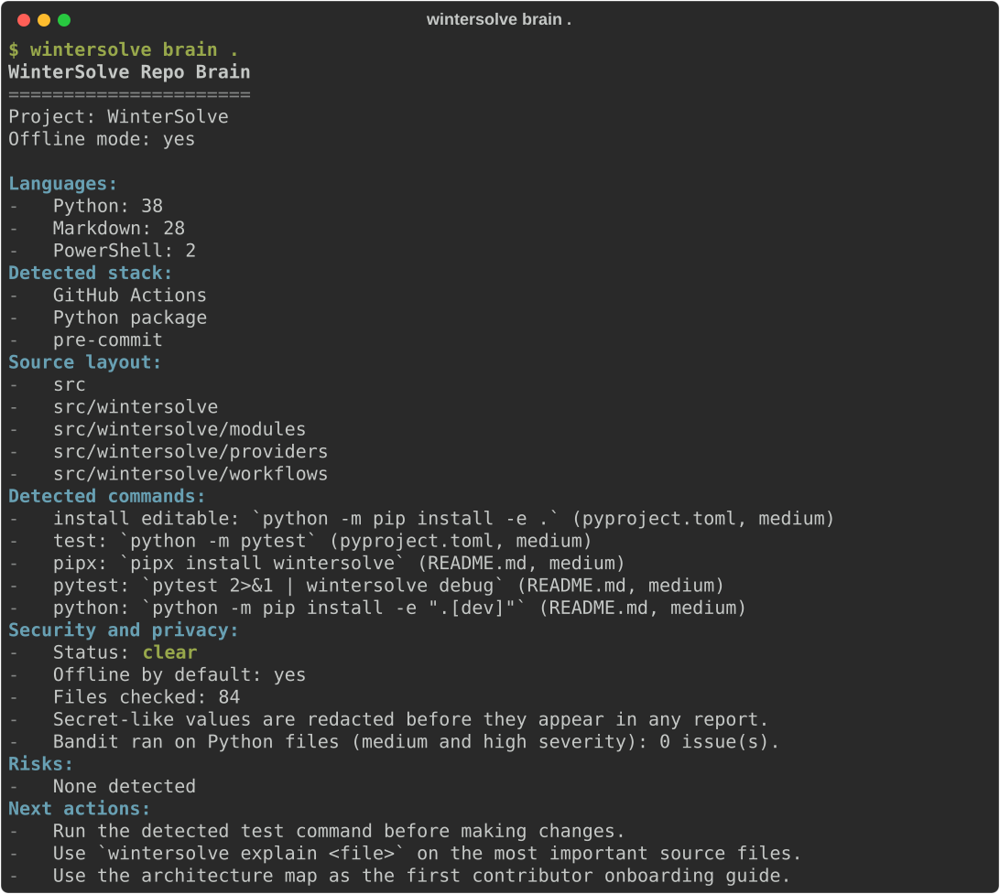

<h1 align="center">WinterSolve</h1>

<p align="center">
  <strong>Understand any repository from the terminal. Offline, in seconds, no account.</strong>
</p>

<p align="center">
  <a href="https://github.com/harshitkrhere/WinterSolve/actions/workflows/ci.yml"></a>
  <a href="https://github.com/harshitkrhere/WinterSolve/actions/workflows/codeql.yml"></a>
  <a href="https://pypi.org/project/wintersolve/"></a>
  <a href="LICENSE"></a>
  
  <a href="https://github.com/astral-sh/ruff"></a>
  
</p>

<p align="center">
  
</p>

You open a repository you have never seen. What is it, how do you run it, where
are the tests, is anything risky, what should you look at first?

`wintersolve brain .` answers all of that in one report: languages and stack,
source and test layout, the commands you need, an architecture map, a security
and privacy check, and a short list of risks and next actions. It reads files;
it never phones home. Output is plain text you can paste into an issue,
Markdown for a wiki, or JSON for your tooling.

## Try it

```bash
pipx install wintersolve        # or: python -m pip install wintersolve
cd path/to/any/project
wintersolve brain .
```

If `wintersolve` is not found afterwards, `python -m wintersolve brain .` always works.
Want the latest commit instead of a release? `pipx install git+https://github.com/harshitkrhere/WinterSolve.git`

## What you get

Real output from running WinterSolve on its own repository (lightly trimmed;
the [full report](examples/sample-reports/wintersolve-repo-brain.md) is in
`examples/`):

```text
WinterSolve Repo Brain
======================
Project: WinterSolve
Offline mode: yes

Languages:
  - Python: 38
  - Markdown: 29
  - PowerShell: 2
Detected stack:
  - GitHub Actions
  - Python package
  - pre-commit
Source layout:
  - src
  - src/wintersolve
  - src/wintersolve/modules
  - src/wintersolve/providers
  - src/wintersolve/workflows
Documentation health:
  - README contains the expected core sections.
  - Core open-source hygiene files are present.
Detected commands:
  - install editable: `python -m pip install -e .` (pyproject.toml, medium)
  - test: `python -m pytest` (pyproject.toml, medium)
  - lint: `pre-commit run --all-files` (.pre-commit-config.yaml, medium)
  - pipx: `pipx install wintersolve` (README.md, medium)
Architecture map:
  - docs: Project documentation; notable: docs/ARCHITECTURE.md, docs/COMMANDS.md, ...
  - src: Application or library source code; notable: src/wintersolve/cli.py, ...
  - tests: Automated tests; notable: tests/conftest.py, tests/test_cli.py, ...
Security and privacy:
  - Status: clear
  - Files checked: 85
  - Secret-like values are redacted before they appear in any report.
  - Bandit ran on Python files (medium and high severity): 0 issue(s).
Risks:
  - None detected
Next actions:
  - Run the detected test command before making changes.
  - Use `wintersolve explain <file>` on the most important source files.
  - Use the architecture map as the first contributor onboarding guide.
```

On a repository with problems, the same report names them: a committed AWS
key (redacted in the output), `eval()` on user input, SQL built from request
data, a missing test directory, a README with no install section.

## Commands

| Command | What it does | Formats |
| --- | --- | --- |
| `wintersolve brain .` | Full project intelligence report (everything below, composed). | text, markdown, json |
| `wintersolve scan .` | Quick health check from file names and marker files only. | text, markdown, json |
| `wintersolve explain FILE` | What one file is, what it defines, what it depends on. | text |
| `wintersolve debug --text "..."` | Likely causes and next steps for an error or stack trace. Also reads stdin. | text |
| `wintersolve docs .` | Missing README sections and hygiene files; `--draft-readme` for a skeleton. | text |
| `wintersolve review .` | Turns your uncommitted changes into review risks and a checklist. | text |

Every command exits `0` on success, `1` if the analysis failed, and `2` for
usage errors or targets that cannot be analyzed. Full reference:
[docs/COMMANDS.md](docs/COMMANDS.md).

A few things people do with it:

```bash
wintersolve brain . --format markdown --output REPO_BRAIN.md     # onboarding doc
wintersolve brain . --format json | jq '.security.findings'       # feed a script
pytest 2>&1 | wintersolve debug                                   # explain a failure
wintersolve brain ~/code/some-repo --no-bandit                    # fastest possible
```

## Why WinterSolve

- **Offline by default.** No API keys, no accounts, no telemetry, no update
  checks. Safe to run on private code.
- **Fast on real repositories.** One filesystem walk that prunes `node_modules`,
  virtual environments, and build output before descending.
- **Honest.** Heuristics are labelled as heuristics. The security section says
  exactly which checks ran, and severity is earned: `high` only for unambiguous
  token formats, never for "this line mentions a password".
- **Structured.** Plain text that pastes cleanly, Markdown for wikis, JSON with
  a `schema_version` for tools. Same commit, same report, every time.
- **Small.** Two runtime dependencies (`typer`, `rich`), plain dataclasses,
  strict typing, tests that run in seconds.

## Use it in CI

```yaml
- run: python -m pip install wintersolve
- run: wintersolve brain . --format markdown --output repo-brain.md
- run: cat repo-brain.md >> "$GITHUB_STEP_SUMMARY"
```

The report shows up in the Actions job summary. A drop-in workflow and the
recipe for failing a build on high-severity findings are in
[docs/INTEGRATIONS.md](docs/INTEGRATIONS.md).

## Installation

| Method | Command |
| --- | --- |
| pipx (recommended) | `pipx install wintersolve` |
| pip | `python -m pip install wintersolve` |
| latest from GitHub | `pipx install git+https://github.com/harshitkrhere/WinterSolve.git` |
| with Bandit for deeper Python checks | `pipx install "wintersolve[security]"` |

Python 3.10 or newer, on Linux, macOS, or Windows. Details and troubleshooting:
[docs/INSTALLATION.md](docs/INSTALLATION.md).

## How it works

```text
cli.py  ->  modules/*.py (one analyzer each)  ->  frozen dataclasses  ->  report.py
```

Analyzers never print and never touch the network. `brain` calls all of them
and composes one report. Adding an analyzer is a module, a renderer, a
few lines in the CLI, and a test. See [docs/ARCHITECTURE.md](docs/ARCHITECTURE.md).

## What it is not

WinterSolve is not an AI assistant and does not need one. It will not write your
code, and its security scan is a first pass, not an audit. There is an optional
provider interface for people who want to build AI features on top of redacted
reports; the CLI never calls it.

## Security and privacy

WinterSolve reads the directory you point it at (skipping `.git`, caches,
virtual environments, and dependency folders), runs `git status` for `review`,
and optionally runs Bandit. That is the complete list. Anything that looks like
a credential is redacted before it reaches a report, and `explain` refuses
files outside the project root. Details: [docs/SECURITY_MODEL.md](docs/SECURITY_MODEL.md).
Found a problem in WinterSolve itself? Please follow [SECURITY.md](SECURITY.md).

## Development and tests

```bash
git clone https://github.com/harshitkrhere/WinterSolve.git && cd WinterSolve
python -m venv .venv && source .venv/bin/activate      # Windows: .venv\Scripts\Activate.ps1
python -m pip install -e ".[dev]"
ruff check . && ruff format --check . && mypy && pytest
```

That last line is the whole quality gate, and it is exactly what CI runs on
Linux, macOS, and Windows across Python 3.10 to 3.14. Tests use temporary
fixture projects and finish in seconds.

## Contributing

Small contributions are the best ones here: a stack marker WinterSolve misses,
a command it should have found, an error message it does not recognise, a
false positive it should not raise. Each is a few lines plus a test.

Start with [CONTRIBUTING.md](CONTRIBUTING.md), or [BEGINNER.md](BEGINNER.md)
for a guided first week. Ideas and questions go in
[Discussions](https://github.com/harshitkrhere/WinterSolve/discussions);
bugs in [Issues](https://github.com/harshitkrhere/WinterSolve/issues).

## Status

Version 0.3.0, alpha. The command set is stable; report wording may still
change between minor versions, and the JSON `schema_version` is bumped for any
breaking change. See the [changelog](CHANGELOG.md) and the [roadmap](ROADMAP.md).

If WinterSolve saved you time, a star helps other people find it.

## License

[MIT](LICENSE).
